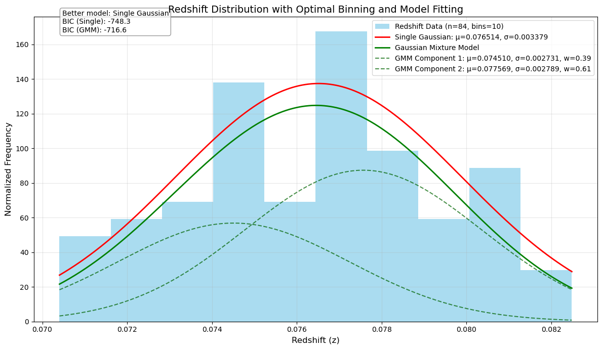
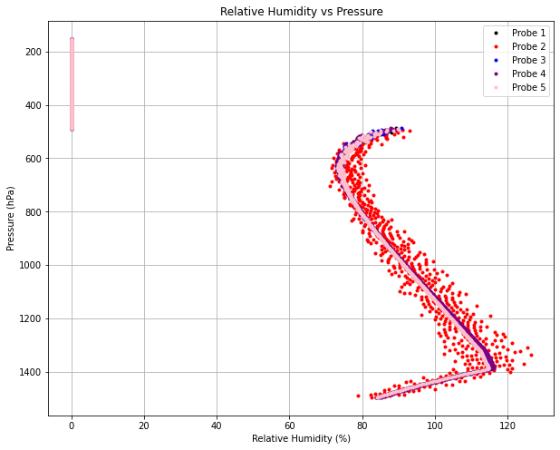

# Data Analysis and Computational Physics Portfolio

Welcome to my portfolio of data analysis and computational physics projects. This repository showcases my skills in statistical analysis, simulation techniques, parameter estimation, and the processing of large scientific datasets across multiple domains of physics and astronomy.

## 📂 Repository Structure

The repository is organized into three main domains:

### [Astrophysics](./astrophysics/)
*Analysis of astronomical survey data and dark matter research.*
- **[Galaxy Cluster Dark Matter Analysis](./astrophysics/aco_2670_dark_matter_analysis.ipynb)**: Estimation of virial mass and mass-to-light ratios for galaxy cluster ACO 2670 using SDSS data. Provides evidence for dark matter dominance through computational techniques applied to large-scale cosmic structures.

### [Atmospheric Science](./atmospheric_science/)
*Advanced analysis of planetary atmospheres and large scientific datasets.*
- **[Exoplanet Atmospheric Analysis](./atmospheric_science/exoplanet_atmospheric_analysis.ipynb)**: Comprehensive characterization of atmospheric composition, thermal structure, and radiative properties using multi-probe measurements on a high-gravity exoplanet.

### [Computational Modeling and Analysis](./computational_modeling/)
*Statistical methods, hypothesis testing, and Monte Carlo simulations.*
- **[Hypothesis Testing Simulation](./computational_modeling/hypothesis_testing_simulation.ipynb)**: Implementation of sampling techniques and analysis of statistical error rates.
- **[Statistical Distance Analysis](./computational_modeling/statistical_distance_analysis.ipynb)**: Maximum likelihood estimation and uncertainty quantification.
- **[Parameter Estimation](./computational_modeling/parameter_estimation.ipynb)**: Complete workflow for model fitting with statistical validation.
- **[Random Variable Simulation](./computational_modeling/statistical_analysis_simulation.ipynb)**: Exploration of probability distributions and the Central Limit Theorem.

---

## 📊 Visual Highlights

<p float="left">
  
  
  
</p>

*Selected outputs: Galaxy Cluster Velocity Dispersion (Left), Exoplanet Relative Humidity Profile (Center), and Monte Carlo Parameter Estimation (Right).*

---

## 🛠️ Technical Skills Demonstrated

**Core Technologies:** `Python` `NumPy` `Pandas` `SciPy` `Matplotlib` `Astropy` `Jupyter`

**Methodologies:**
- **Statistical Analysis:** Hypothesis testing, error propagation, Monte Carlo simulations, Bayesian inference (BIC).
- **Physical Modeling:** Thermodynamics, radiative transfer, hydrostatic equilibrium, virial theorem application.
- **Data Processing:** Large dataset handling, iterative algorithms, outlier rejection, signal-to-noise optimization.
- **Visualization:** Publication-quality plotting, multi-dimensional data representation.

---

## 🚀 Getting Started

To reproduce these analyses or explore the code locally:

1. **Clone the repository:**
```bash
   git clone https://github.com/JacksonFergusonDev/Data-Science-Portfolio.git
   cd Data-Science-Portfolio
```

2. **Create a virtual environment:**
```bash
   python3 -m venv venv
   source venv/bin/activate
```

3. **Install dependencies:**
```bash
   pip install -r requirements.txt
```

4. **Open in VS Code:**
```bash
   code .
```
   *(Or launch with `jupyter notebook` if you prefer the browser interface)*

---

## 📫 Connect With Me

- **GitHub:** [@JacksonFergusonDev](https://github.com/JacksonFergusonDev)
- **LinkedIn:** [Jackson Ferguson](https://www.linkedin.com/in/jackson--ferguson/)
- **Email:** jackson.ferguson0@gmail.com

Feel free to reach out if you'd like to discuss these projects or potential collaborations!