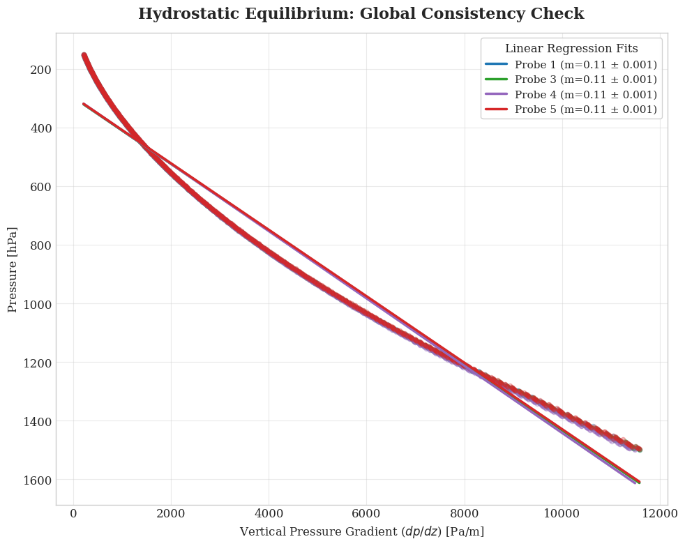
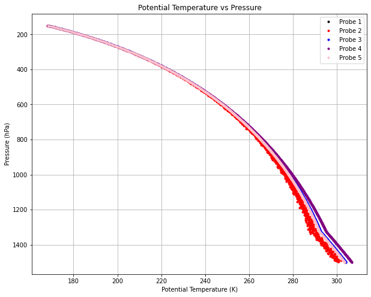

# Exoplanet Atmospheric Analysis Pipeline

[](../README.md)


**A computational atmospheric science pipeline reconstructing the thermodynamic profile and stability of a high-gravity exoplanet using probe telemetry.**

💻 **[View the Analysis Notebook](exoplanet_atmospheric_analysis.ipynb)**

---

## 🎯 Project Overview
This project analyzes telemetry data from five descent probes deployed into the atmosphere of a high-gravity exoplanet ($g = 20 \, \text{m/s}^2$). By processing raw sensor data (pressure, temperature, density), the pipeline reconstructs the atmospheric structure, validates hydrostatic equilibrium, and derives key hydrological parameters.

**Data Source:** The analysis is performed on a **synthetic dataset** representing a hypothetical high-gravity world. The primary goal is to demonstrate the application of atmospheric physics and numerical integration techniques to raw telemetry logs.

**Key Result:** The analysis reveals a stable, well-mixed troposphere with a global mean precipitation rate of **$0.086 \pm 0.013 \text{ mm/hr}$** and a water vapor residence time of **$19.9 \pm 3.4$ Earth days**.

---

## 📊 Key Visualizations

### 1. Stability & Structure
*We validate the mechanical stability of the atmosphere and reconstruct missing sensor data using physical laws.*

<p float="left">
  
   
</p>

* **Left:** Hydrostatic Equilibrium Verification. The linear relationship between pressure ($P$) and vertical gradient ($dp/dz$) across all five probes confirms the atmosphere is in global hydrostatic balance.
* **Right:** Temperature Profile Reconstruction. By inverting the hydrostatic equation, we successfully recovered missing temperature data (red) for Probe 2, validating it against the other probes.

### 2. Hydrology & Thermodynamics
*Derived parameters characterizing the planet's water cycle and opacity.*

<p float="left">
  
</p>

* **Center:** Relative Humidity Profile. The vertical distribution of humidity shows a clear structure, allowing us to integrate the total precipitable water vapor (PWV) and estimate the opacity ($\tau$) of the atmosphere to infrared radiation.

---

## 🛠️ Technical Implementation

The analysis is built in **Python** using a modular functional approach, emphasizing physical derivation over black-box modeling.

### Data Pipeline & Cleaning
* **Data Ingestion:** Parses raw telemetry text files into structured arrays for five distinct probes.
* **Noise Filtering:** Implements a signal-to-noise threshold ($q < 5 \times 10^{-4}$) on specific humidity data to remove unphysical sensor artifacts in the upper atmosphere.

### Atmospheric Physics
* **Hydrostatic Balance:** Validates equilibrium by performing linear regression on pressure gradients ($\frac{dp}{dz} = -\rho g$).
* **Composition Analysis:** Derives the mean molar mass ($\mu \approx 28.5 \text{ g/mol}$) by calculating the mass-weighted harmonic mean of N$_2$, He, Ar, CO$_2$, and H$_2$O.
* **Thermodynamics:** Computes the dry adiabatic lapse rate ($\Gamma_d$) and potential temperature ($\theta$) to identify the tropopause and assess convective stability.

### Radiative Transfer & Hydrology
* **Optical Depth:** Calculates the vertical optical depth ($\tau$) for CO$_2$ and H$_2$O by integrating extinction coefficients derived from absorption cross-sections.
* **Global Water Cycle:** Estimates the global precipitation rate and residence time using a steady-state energy balance model, propagating uncertainties from solar flux and latent heat fractions.

---

## 📊 Final Results Summary

| Parameter | Value | Uncertainty | Description |
| :--- | :--- | :--- | :--- |
| **Surface Gravity** | $20.0 \, \text{m/s}^2$ | - | Planet-specific constant |
| **Mean Gamma** | $1.47$ | - | Adiabatic Index ($\gamma$) |
| **Mean Lapse Rate** | $15.29 \, \text{K/km}$ | - | Dry adiabatic cooling rate |
| **Precipitation Rate** | $0.0864 \, \text{mm/hr}$ | $\pm 0.0127$ | Global mean rainfall |
| **Residence Time** | $19.85 \, \text{Days}$ | $\pm 3.40$ | Atmospheric water turnover |

---

## 🚀 Quick Start

This project is part of my Data Science Portfolio. To reproduce the analysis:

1.  **Clone the portfolio repository:**
    ```bash
    git clone [https://github.com/JacksonFergusonDev/Data-Science-Portfolio.git](https://github.com/JacksonFergusonDev/Data-Science-Portfolio.git)
    cd Data-Science-Portfolio
    ```

2.  **Install shared dependencies:**
    ```bash
    pip install -r requirements.txt
    ```

3.  **Launch the Atmospheric Science analysis:**
    ```bash
    cd atmospheric_science
    jupyter notebook exoplanet_atmospheric_analysis.ipynb
    ```

---

### Author
**Jackson Ferguson** Astrophysics Undergraduate, University of Victoria  
[GitHub Profile](https://github.com/JacksonFergusonDev) | [LinkedIn](https://linkedin.com/in/jackson--ferguson/)