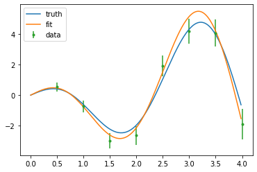
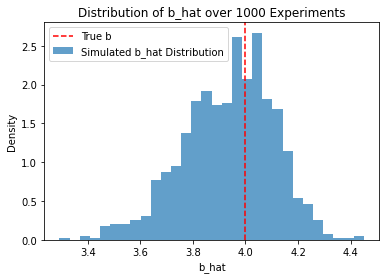
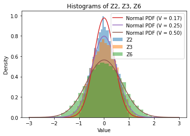

# Computational Modeling and Analysis

## [Hypothesis Testing Simulation with Critical Value Analysis](hypothesis_testing_simulation.ipynb)

This project demonstrates fundamental concepts of statistical hypothesis testing through simulation. The code implements and analyzes two competing probability distributions (H0 and H1) to explore statistical error rates and sampling methods.

### Key Features:
- Calculation of normalization constants for probability density functions
- Determination of critical value for a 95% confidence level hypothesis test
- Implementation of specialized sampling techniques:
  - Inverse transform sampling for H0
  - Accept-reject method for H1
- Empirical measurement of Type I and Type II error rates
- Visual comparison of theoretical PDFs against generated sample distributions

---

## [Statistical Distance Analysis Between Uniform Random Points](statistical_distance_analysis.ipynb)

This project demonstrates statistical inference techniques by analyzing the distances between random points on two parallel rods. The implementation includes:

### Key Features:
- Simulation of random points on parallel rods with specified geometry
- Derivation and visualization of the theoretical probability density function
- Maximum likelihood estimation of rod length from distance measurements
- Uncertainty quantification using both numerical and analytical second derivatives
- Bootstrap validation through 1000 replicate experiments
- Analysis of estimator bias and variance

---

## [Parameter Estimation and Statistical Validation](parameter_estimation.ipynb)

This project demonstrates a complete workflow for parameter estimation and statistical validation using synthetic data. The code simulates a physical system with the model function `a*t*cos(b*t)`, estimates parameters via chi-square minimization, and validates the statistical properties of the estimation process.

### Key Features:
- Generation of synthetic data with non-uniform error bars
- Parameter estimation using chi-square minimization
- Uncertainty calculation from the Hessian matrix

 
*Figure 1: Comparison of the synthetic data (with error bars) against the optimized model fit. The residuals indicate the quality of the estimation.*

- Monte Carlo validation of parameter estimates (1000 replications)
- Pull distribution analysis to verify uncertainty estimates
- Chi-square distribution analysis to confirm proper fit statistics

 
*Figure 2: Distribution of the estimated parameter $\hat{b}$ across 1000 Monte Carlo trials. The Gaussian shape confirms the validity of the error estimation methods.*

---

## [Statistical Analysis and Simulation of Random Variables](statistical_analysis_simulation.ipynb)

This project explores statistical concepts through simulation and visualization. It consists of two main parts: a match outcome simulator and an exploration of the Central Limit Theorem and correlated random variables.

### Key Features:
- Simulation of game outcomes (wins/losses/draws) with fixed probabilities
- Statistical comparison between theoretical and empirical distributions
- Visualization of bivariate relationships with and without added noise
- Demonstration of the Central Limit Theorem with different sample sizes

 
*Figure 3: Histograms of sum-variables ($Z_2, Z_3, Z_6$) showing the convergence toward a Normal distribution as predicted by the Central Limit Theorem.*

- Generation and analysis of correlated random variables through common factors
- Empirical validation of theoretical covariance and correlation coefficients